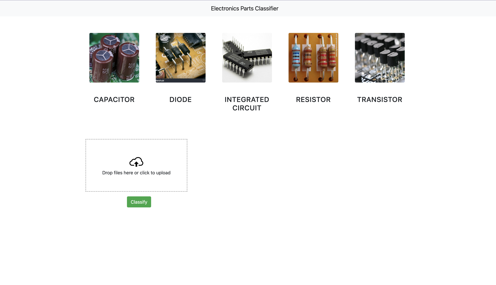

# Electronic parts classifier

## Description

---

In this project, I used TensorFlow and transfer learning to train a electronic parts classification model. This project consists of 3 main parts;

- **Web scraping**
  - Using selenium and beautifulsoup4 to scrap electronic parts images
- **Model training**
  - First I used basic deep neural network, but it didn't generalize well, then I used transfer learning to train a model
- **UI**
  - In UI part Flask, Javascript, CSS and HTML used

Electronic parts that you can classify,

- Capacitor
- Diode
- Integrated Circuit
- Resistor
- Transistor

### Main page

---



## Usage

---

```
# Clone the project
git clone https://github.com/mehmetzmn/Electronic-component-classifier.git
cd "Electronic-component-classifier"

# Create a virtual environment
python -m venv .venv

# activate venv
. .venv/bin/activate

# install requirements
pip install -r requirements.txt

# run main.py
python src/main.py

# Click UI/app.html file

```

### Requirements

---

- ipykernel==6.23.0
- selenium==4.9.1
- beautifulsoup4==4.12.2
- requests==2.30.0
- tqdm==4.65.0
- matplotlib==3.7.1
- opencv-python==4.7.0.72
- flask==2.3.2
- tensorflow==2.13.0rc0
