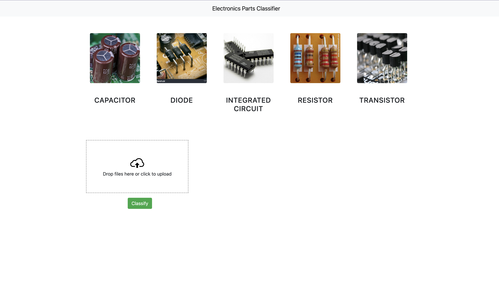

This part of the project was taken from **codebasics** youtube channel, credits to **codebasics** and it was adapted to the project after minor changes.

It has a simple HTML page where user drags an image of electronic part and classify.

